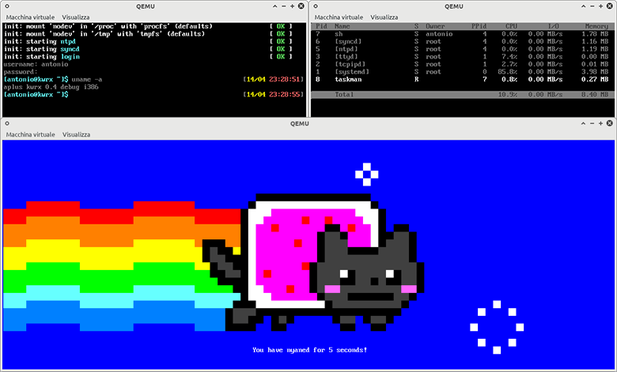

# aplus `#os`
[](https://github.com/kwrx/aplus/actions/workflows/deploy.yml)
[](https://github.com/kwrx/aplus/releases/latest)
[](/LICENSE) 

*A hobbyist operating system built mostly from scratch with a unix-like, hybrid and cross-platform kernel.*

## :fire: Features

* **Cross-platform**: [arch/*](/arch), designed for cross-platform environment targets
* **Multitasking**: Thread and Process support with SMP
* **Network**: [kernel/network/](/kernel/network), Almost full TCP/IP Network Stack by [lwIP](https://savannah.nongnu.org/projects/lwip/)
* **Unix-like**: VFS, Signals, Pipes, IPC, Shared Memory, Unix Sockets
* **ELF**: Dynamic and static executables 
* **Linux Framebuffer**: Linux-like framebuffer support
* **Linux Syscalls**: Linux-like syscall layer
* **Virtio**: Virtio devices (gpu, block, network, crypto)
* **GUI**: coming soon...
  
See [FEATURES.md](/docs/FEATURES.md) for more information about features. 
  
<br>
<p align="center" width="100%">
    </img>
</p>


## :electron: Kernel
The kernel provides a basic *unix* environment with a minimal subset of *posix* stuff.
Futhermore, it uses a modular architecture with loadables kernel objects and run on different platforms like x86, x86_64, ARM, etc.


## :robot: Userspace
aplus userspace is still under development. It provides several GNU/Linux core tools, devtools like `gcc` or `binutils`, a very simple Java Virtual Machine, graphical interface, windows manager, services like NTP, I/O Cache Sync and so on.

Userspace has **multi-user** environment with unix permission support, superuser (root), unix-like filesystem with `/proc` and `/dev` implementation

## :electric_plug: Drivers
Modules provides various core platform features: caching, char/block devices, filesystems, I/O devices, system low-level services, network, audio/video and virtio support.

### Notable modules
* **Device Interface**, [dev/*](/drivers/dev), provides a standard interface for drivers
* **AHCI** (Advanced Host Controller Interface), [platform/pc/block/ahci](/drivers/platform/pc/block/ahci/main.c), almost full SATA/SATAPI driver
* **BGA** (Bochs Video), [platform/pc/video/bga](/drivers/platform/pc/video/bga/main.c), Bochs Virtual VGA Adapter
* **Intel e1000** (Network device), [platform/pc/network/e1000](/drivers/platform/pc/network/e1000/main.c), Intel NIC driver
* **Virtio**, [virtio/*](/drivers/virtio), Virtio devices interfaces

---

## :zap: Getting Started
0. Clone this repository and change working directory.
```bash
$ git clone https://github.com/kwrx/aplus
$ cd aplus
```

Now you have basically two options to build image from sources.

### Building with Docker (Recommended):
1. Pull and run the build system in a docker image environment

```console
# docker pull alpine
# docker run --privileged=true -v $(pwd):/opt/aplus -w /opt/aplus -t alpine \
    ./extra/utils/build-with-docker TARGET
```

2. Run it (Linux):
```
$ ./extra/utils/run-qemu TARGET
```

**NOTE:** replace `TARGET` with the target build: `i686`, `x86_64`, etc.

### Building with Toolchain:
It's recommended you use a recent Linux host environment with this method.

Some packages are required for the build system:
* `binutils`, `make`, `autoconf`, `automake` (or `build-essential` on Ubuntu/Debian)
* `gcc`, `g++`, `libisl.19` to compile c/c++ sources
* `nasm` to compile asm sources
* `python3` to run some build scripts
* `e2fsprogs`, `grub`, `parted`, `dd`, `fc-scan` to generate hdd image
* `qemu` or `VirtualBox` to run Virtual Machine  

<br>

1. Install dependencies
```bash
$ pip3 install -r docs/requirements.txt
```

2. Configure and check environment
```bash
$ ./configure
```

3. Run it
```bash
$ ./makew run
```

---

## :globe_with_meridians: Third-Party Software:
`aplus` uses and depends on a large number of third-party open-source tools and libraries which are outside of this repository.

Licenses for the included third-party tools and libraries can be found [here](/extra/licenses), and for project [here](/LICENSE)

