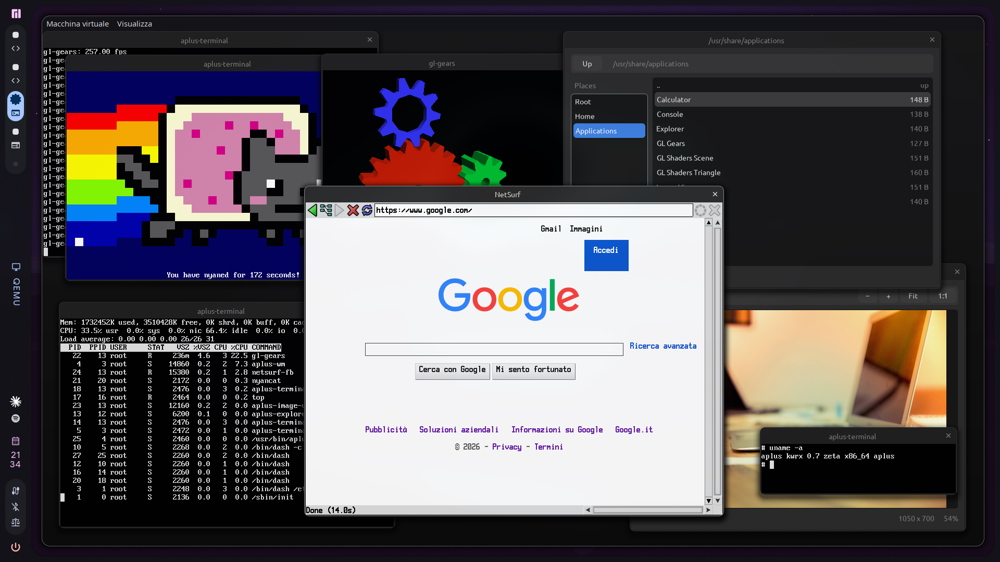
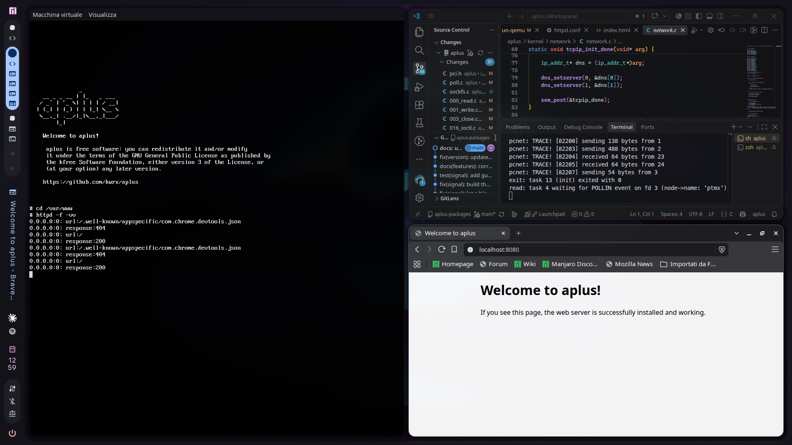

# aplus `#os`
[](https://github.com/kwrx/aplus/releases/latest)
[](/LICENSE) 

`aplus` is a Unix-like operating system built almost entirely from scratch — a hybrid kernel with loadable kernel modules, its own drivers, and a small userspace on top. The kernel is written in C, with assembly for the architecture-specific parts; the cross toolchain builds C and C++ programs to run on it.

It started in September 2013 as a way to learn low-level and systems programming, and it is still a hobby project rather than a production system. Today it boots on `x86_64` and provides a Linux-like syscall layer, a VFS with several filesystems, an lwIP TCP/IP stack, SMP multitasking and an early graphical stack — with a good deal still unimplemented.

## :fire: Features

* **Hybrid kernel**: modular design with loadable kernel objects, see [drivers/*](/drivers)
* **Cross-platform**: [arch/*](/arch), designed for cross-platform environment targets. `x86_64` is the target that boots and runs today; `i686` and `aarch64` are placeholders
* **Multitasking**: processes and threads (`fork`, `vfork`, `clone`, `execve`) with SMP support
* **Virtual memory**: on-demand paging with `mmap`, `mprotect` and `brk`
* **Filesystems**: [kernel/fs/](/kernel/fs), a VFS with ext2, ISO 9660, tmpfs, procfs and bindfs
* **Network**: [kernel/network/](/kernel/network), almost full TCP/IP Network Stack by [lwIP](https://savannah.nongnu.org/projects/lwip/), reachable through BSD sockets — ordinary file descriptors, so `dup2`, `fork` inheritance and `poll` work on them like any other, with `getsockname`, `getpeername` and `get`/`setsockopt` translating the Linux option numbers lwIP does not share
* **Unix-like**: Signals, Pipes, Futex, Unix domain sockets, TTY and PTY
* **I/O Multiplexing**: `poll`, `ppoll`, `select` and `pselect`
* **ELF**: static executables; dynamic linking is not supported yet
* **Linux Syscalls**: Linux-like syscall layer, see [SYSCALLS.md](/docs/SYSCALLS.md)
* **Linux Framebuffer**: Linux-like framebuffer support, with damage-based flushing and a hardware cursor plane on adapters that provide one
* **Virtio**: Virtio devices (gpu, net, input, console, random) over Virtio PCI
* **GUI**: a [display server](/apps/sysutils/aplus-wm) that owns the framebuffer and the input devices, draws window decorations itself, and hands out windows to clients over a Unix socket

See [FEATURES.md](/docs/FEATURES.md) for more information about features. 
  
<br>
<p align="center" width="100%">
    </img>
</p>


## :electron: Kernel
The kernel provides a basic *unix* environment with a minimal subset of *posix* stuff.
It is a hybrid kernel: core subsystems are built in, while drivers are loadable kernel objects linked and started at runtime by the [module loader](/kernel/init/module.c).

* **Tasking**, per-CPU run queues with SMP support, signal delivery and futex-based sleeping
* **Memory**, [kernel/mm/](/kernel/mm), physical memory manager and kernel heap on top of on-demand paging
* **IPC**, [kernel/ipc/](/kernel/ipc), spinlocks, semaphores, futexes and Unix domain sockets
* **VFS**, [kernel/fs/](/kernel/fs), inode-based virtual filesystem with a dentry cache, and a `/proc` that exposes per-process state down to the open descriptors in `/proc/<pid>/fd`
* **Network**, [kernel/network/](/kernel/network), the lwIP stack wired up to the socket syscalls
* **Syscalls**, [kernel/syscalls/](/kernel/syscalls), one file per entry, numbered from [syscalls.json](/scripts/gen-syscalls/syscalls.json)

It currently boots and runs on `x86_64`; support for other architectures such as `i686` and `aarch64` is still to be written.


## :robot: Userspace
Userspace is still under development, and is assembled from two sources: the programs built from this repository, and prebuilt packages fetched at `./configure` time from [aplus-packages](https://github.com/kwrx/aplus-packages).

Built here: the [init system](/apps/core/init) and its [init.sh](/apps/core/init/scripts/init.sh) boot script, a [display server](/apps/sysutils/aplus-wm) with its [client library](/lib/aplus/ui), a [terminal emulator](/apps/sysutils/aplus-terminal) on top of `libtsm` and `cairo`, a [file manager](/apps/sysutils/aplus-explorer), a [calculator](/apps/sysutils/aplus-calculator), an [image viewer](/apps/sysutils/aplus-image-viewer) that draws PNG, JPEG and WebP through [cairo-ext](/lib/aplus/cairo-ext), an [application launcher](/apps/sysutils/aplus-launcher) on `Super+Space` that searches the installed `.desktop` files, the [aplus-xopen](/apps/sysutils/aplus-xopen) opener that hands a path to whichever of them handles it, the `kilo` editor, `nyancat`, an [IRC client](/apps/extra/irc), three MesaGL demos ([gears](/apps/extra/gl-gears), a [shaded triangle](/apps/extra/gl-shaders-triangle) and a [raymarched scene](/apps/extra/gl-shaders-scene)), and a set of [test programs](/apps/test) — guest-side integration tests, run from the shell, covering signals, pipes, pseudo-terminals, sockets, `select`, the virtual memory manager and the [virtio device nodes](/apps/test/virtio-test).

Pulled in as packages by the default `x86_64` preset: BusyBox, the `dash` and `bash` shells, system fonts, cursors, keymaps and sample pictures, the `zlib`, `libpng`, `libjpeg`, `libwebp`, `freetype`, `pixman` and `cairo` libraries, plus Doom and a NES emulator. Others are optional and off by default — among them `gcc`, `binutils`, MesaGL, a Javascript interpreter and a very simple Java Virtual Machine — and can be toggled from the Kconfig menu.

Furthermore, userspace has a **multi-user** environment with superuser (root) and a unix-like filesystem with `/proc` and `/dev` implementation.

Graphical programs are windowed rather than each taking over the screen: [aplus-wm](/apps/sysutils/aplus-wm) owns `/dev/fb0` and the input devices, draws every titlebar and border itself, and hands clients a buffer to draw into through [libui](/lib/aplus/ui). The terminal emulator, the sysutils applications and the MesaGL demos are ordinary clients of it. Where the adapter composites a cursor plane of its own — virtio-gpu does — the pointer moves without touching the framebuffer at all. Below, the `gl-gears` demo draws into a window of its own, stacked above the terminal that launched it — both frames drawn by the server rather than by the programs inside them.

Networked programs work end to end: below, BusyBox `httpd` is serving `/var/www` from inside the guest to a browser on the host, over the forwarded port set up by [run-qemu](/scripts/run-qemu).

<br>
<p align="center" width="100%">
    </img>
</p>

## :electric_plug: Drivers
Drivers are loadable kernel objects: one directory with a `main.c` per module, each declaring its identity and dependencies through `MODULE_NAME()`/`MODULE_DEPS()` and exporting `init`/`dnit` entry points. The tree currently builds 32 of them, covering device-class interfaces, char and block devices, terminals, input, network, video and virtio.

### Notable modules
* **Device Interface**, [dev/*](/drivers/dev), provides a standard interface for drivers (block, char, network, video, pci)
* **AHCI** (Advanced Host Controller Interface), [platform/pc/block/ahci](/drivers/platform/pc/block/ahci/main.c), almost full SATA/SATAPI driver
* **Bochs VGA**, [platform/pc/video/bochs-vga](/drivers/platform/pc/video/bochs-vga/main.c), Bochs Virtual VGA Adapter
* **VMware VGA**, [platform/pc/video/vmware](/drivers/platform/pc/video/vmware/main.c), VMware SVGA II Adapter
* **Intel e1000** (Network device), [platform/pc/network/e1000](/drivers/platform/pc/network/e1000/main.c), Intel NIC driver
* **PCNET** (Network device), [platform/pc/network/pcnet](/drivers/platform/pc/network/pcnet/main.c), AMD PCnet NIC driver
* **PS/2**, [platform/pc/input/ps2](/drivers/platform/pc/input/ps2/main.c), keyboard and mouse
* **TTY**, [tty/*](/drivers/tty), terminal devices, `/dev/ptmx` and pseudo-terminal pairs
* **VirtIO**, [virtio/*](/drivers/virtio), VirtIO device interfaces over VirtIO PCI — [gpu](/drivers/virtio/virtio-gpu/main.c) with damage flushing and a cursor plane, [input](/drivers/virtio/virtio-input/main.c) for absolute pointing devices, [net](/drivers/virtio/virtio-net/main.c) feeding the lwIP stack, plus console and random

---

## :zap: Getting Started
0. Clone this repository and change working directory.
```console
$ git clone https://github.com/kwrx/aplus
$ cd aplus
```

### Build from Linux:
It's recommended you use a recent Linux host environment with this method.

Some packages are required for the build system:
* `git`, `make`, `autoconf`, `automake` (or `build-essential` on Ubuntu/Debian)
* `gcc`, `ld` to compile sources and link objects
* `python3` to run some build scripts
* `mke2fs`, `mkfs.vfat`, `mcopy`, `mmd`, `sgdisk`, `grub-mkstandalone`, `dd`, `truncate`, `fc-scan` to generate hdd image
* `tar`, `gzip`, `zip`, `find`, `awk`, `od` for the remaining build steps
* `qemu` or `VirtualBox` to run Virtual Machine  

<br>


1. Configure and check environment
```console
$ ./configure
```
   This opens the Kconfig menu. To build a preset from [build/setup](/build/setup) without it:
```console
$ ./configure --kconfig x86_64
```

2. Build it
```console
$ ./makew all
```

3. Run it
```console
$ ./makew run
```
   Use `./makew run-headless` to run without a graphical display, which is handy to capture console output.

---

## :books: Documentation
* [FEATURES.md](/docs/FEATURES.md) — per-architecture and per-subsystem feature matrix
* [SYSCALLS.md](/docs/SYSCALLS.md) — the syscall table
* [REPORT.md](/docs/REPORT.md) — outstanding `TODO`/`FIXME` markers in the tree

---

## :globe_with_meridians: Third-Party Software:
`aplus` uses and depends on a large number of third-party open-source tools and libraries which are outside of this repository.

## :page_with_curl: License
This project is licensed under the GNU General Public License v3.0 - see the [LICENSE](/LICENSE) file for details.

